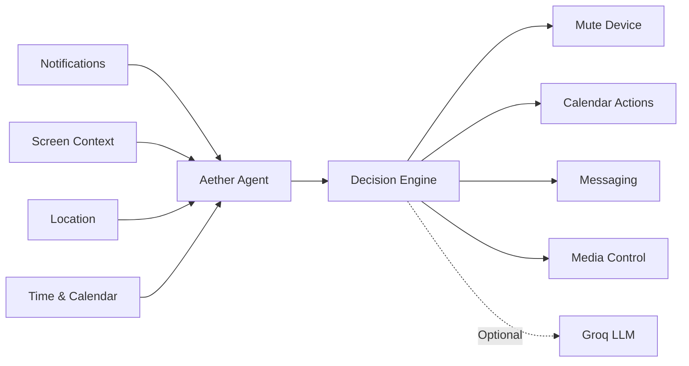

# Aether — Personal Mobile Agent

**A proactive Android agent that observes context, learns routines, and automates actions on your behalf.**

---

## Overview

Aether transforms an Android phone from a reactive device into a proactive assistant.

Instead of waiting for commands, Aether continuously monitors contextual signals such as notifications, screen content, location, and time. It uses these signals to predict user intent and perform actions automatically.

### Examples

* Mute the phone before scheduled meetings
* Launch workout playlists when arriving at the gym
* Create calendar events from natural language requests
* Send birthday wishes automatically
* Open meeting links and reminders before events
* Perform routine actions through Accessibility Services

---

## Architecture

### Core Components

| Component            | Purpose                                                            |
| -------------------- | ------------------------------------------------------------------ |
| Context Collectors   | Gather signals from notifications, screen, location, and schedules |
| Decision Engine      | Determines when and how actions should be executed                 |
| Local Memory         | Stores learned preferences and user corrections                    |
| Action Layer         | Executes actions using Android system services                     |
| Cloud LLM (Optional) | Handles complex natural language understanding                     |

---

## Technology Stack

* **Kotlin**
* **Jetpack Compose**
* **MVVM Architecture**
* **Room Database**
* **WorkManager**
* **Foreground Services**
* **NotificationListenerService**
* **AccessibilityService**
* **Fused Location Provider**
* **Cloudflare Workers**
* **Groq API (Optional)**

---

## Key Ideas

* Context-aware automation
* On-device decision making
* Habit learning through user feedback
* Privacy-first design
* Optional cloud intelligence

---

## Future Work

* Multi-agent task planning
* Cross-device synchronization
* RAG-based long-term memory
* Custom automation workflows

---

**Aether explores what a truly proactive mobile assistant could look like when integrated directly into the Android operating environment.**
